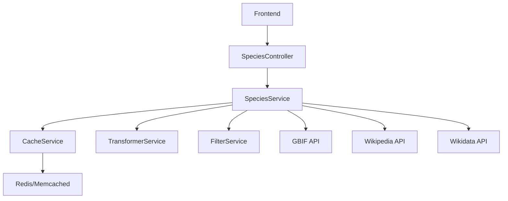

# 🦎 Captivia - Présentation du Projet

## 📋 Vue d'ensemble

**Captivia** est une application de gestion et de découverte d'espèces animales, avec un focus particulier sur les reptiles et amphibiens. L'application permet de rechercher, consulter et analyser des données biologiques à partir de sources ouvertes.

**Type**: Application web monopage (Single Page Application)  
**Langue**: Français  
**Licence**: Private

---

## 🏗️ Architecture Technique

### Stack Technologique

#### Backend (NestJS)
- **Framework**: NestJS (modulaire et scalable)
- **ORM**: Prisma avec PostgreSQL
- **Cache**: Redis (optionnel) / Memcached / Mémoire
- **API Client**: Axios avec retry automatique
- **Validation**: class-validator & class-transformer
- **Documentation**: Swagger/OpenAPI
- **Rate Limiting**: rate-limiter-flexible avec Redis

#### Frontend (Next.js)
- **Framework**: Next.js 15 (App Router)
- **Langage**: TypeScript
- **Styling**: CSS moderne avec gradients
- **API Client**: Fetch API personnalisé
- **Mode**: Client-side rendering avec hooks React

---

## 📁 Structure du Projet

```
captivia/
├── backend/                          # API NestJS
│   ├── src/
│   │   ├── species/                  # Module principal espèces
│   │   │   ├── species.controller.ts  # Endpoints API
│   │   │   ├── species.service.ts     # Logique métier
│   │   │   ├── advanced-search.service.ts
│   │   │   └── advanced-search.controller.ts
│   │   ├── cache/                    # Gestion du cache
│   │   │   ├── cache.service.ts
│   │   │   ├── redis-cache.service.ts
│   │   │   └── memcached-cache.service.ts
│   │   ├── transformers/             # Normalisation des données
│   │   │   ├── species-transformer.service.ts
│   │   │   └── data-transformer.interface.ts
│   │   ├── filters/                  # Filtres personnalisés
│   │   │   ├── species-filter.service.ts
│   │   │   └── species-filter.interface.ts
│   │   ├── external/                 # Services API externes
│   │   │   ├── gbif.service.ts
│   │   │   ├── wikipedia/wikipedia.service.ts
│   │   │   └── wikidata/wikidata.service.ts
│   │   ├── gateway/                  # API Gateway multi-sources
│   │   │   └── api-gateway.service.ts
│   │   ├── monitoring/               # Surveillance & Analytics
│   │   │   ├── metrics.service.ts
│   │   │   ├── error-tracking.service.ts
│   │   │   └── monitoring.controller.ts
│   │   ├── analytics/                # Analyses API
│   │   │   └── api-analytics.service.ts
│   │   ├── health/                   # Health checks
│   │   │   └── health.controller.ts
│   │   ├── database/                 # Optimisation DB
│   │   │   └── database-optimization.service.ts
│   │   ├── common/                   # Partagé
│   │   │   ├── guards/               # Rate limiting
│   │   │   ├── filters/              # HTTP exceptions
│   │   │   └── interceptors/         # Logging
│   │   └── app.module.ts             # Module racine
│   └── package.json
│
├── frontend/                         # Application Next.js
│   ├── src/
│   │   ├── app/                      # Routes Next.js
│   │   │   ├── page.tsx             # Page d'accueil
│   │   │   ├── species/[id]/page.tsx
│   │   │   ├── search/
│   │   │   └── compare/
│   │   ├── components/               # Composants UI
│   │   │   ├── layout/
│   │   │   ├── search/
│   │   │   ├── species/
│   │   │   └── favorites/
│   │   └── lib/
│   │       └── api.ts               # Client API
│   └── package.json
│
├── plans/                            # Documentation
│   └── backend-refactor-plan.md
├── LAUNCH.md                         # Guide de lancement
└── package.json                      # Scripts racine
```

---

## 🔌 API Endpoints

### Espèces

| Méthode | Endpoint | Description |
|---------|----------|-------------|
| GET | `/species/search` | Recherche d'espèces avec filtres |
| GET | `/species/:id` | Détails de l'espèce |
| GET | `/species/:id/vernacular` | Noms vernaculaires |
| GET | `/species/:id/iucn` | Statut IUCN |
| GET | `/species/:id/distributions` | Données de distribution |
| GET | `/species/:id/media` | Médias (photos) |
| GET | `/species/:id/metrics` | Métriques |
| GET | `/species/:id/occurrences/count` | Comptage des occurrences |

### Recherche Avancée

| Méthode | Endpoint | Description |
|---------|----------|-------------|
| GET | `/species/search/advanced` | Recherche avec tous les filtres |
| GET | `/species/search/suggestions` | Suggestions de recherche |
| GET | `/species/search/filters` | Recherche par filtres contextuels |
| GET | `/species/search/conservation/:status` | Par statut de conservation |
| GET | `/species/search/region/:region` | Par région |
| GET | `/species/search/taxonomy/:taxonomic` | Par taxonomie |
| GET | `/species/search/media/:hasMedia` | Avec présence de médias |
| GET | `/species/search/iucn/:hasIucn` | Avec présence d'IUCN |

### Monitoring & Analytics

| Méthode | Endpoint | Description |
|---------|----------|-------------|
| GET | `/monitoring/metrics` | Métriques système |
| GET | `/monitoring/health` | Statut de santé |
| GET | `/analytics` | Analytics API |
| GET | `/errors/stats` | Statistiques d'erreurs |

---

## 🎯 Fonctionnalités Principales

### 1. Recherche d'espèces
- Recherche textuelle avec filtres avancés
- Filtres par taxonomie (reptiles, amphibiens, oiseaux, etc.)
- Filtres par statut de conservation (IUCN)
- Filtres par région (France, Belgique, Suisse, Europe)
- Suggestions intelligentes

### 2. Données Espèces
- Classification taxonomique complète (royaume, phylum, classe, ordre, famille, genre)
- Statut de conservation (IUCN, CITES, BERNE, CMS)
- Noms vernaculaires par langue
- Données de distribution géographique
- Médias (photos, vidéos)
- Métriques d'utilisation

### 3. Multi-sources de données
- **GBIF** (Global Biodiversity Information Facility) - Données biologiques principales
- **Wikipedia** - Informations complémentaires et descriptions
- **Wikidata** - Données structurées et classifications

### 4. API Gateway
- Coordination multi-sources
- Fallback automatique en cas d'échec
- Enrichissement des données
- Cache distribué

### 5. Monitoring & Analytics
- Métriques de performance
- Suivi des erreurs
- Analytics d'utilisation
- Optimisation des requêtes

---

## ⚙️ Architecture de Design

### Pattern API Gateway
L'application utilise le pattern **API Gateway** pour coordonner les requêtes entre plusieurs sources de données externes.



### Stratégies de Cache

| Type de donnée | TTL | Source |
|----------------|-----|--------|
| Recherche (sans filtres) | 24h | Cache |
| Détails espèce | 24h | Cache |
| Médias | 1h | Cache |
| Vernaculaires | 12h | Cache |
| Distributions | 24h | Cache |
| Métriques | 7j | Cache |
| Occurrences | 7j | Cache |

---

## 📊 Types de Données

### TransformedSpecies (interface principale)
```typescript
{
  key: number;                    // ID GBIF
  name: string;
  canonicalName: string;
  scientificName?: string;
  rank: string;                   // espèce, genre, famille, etc.
  kingdom: string;
  phylum: string;
  class: string;
  order: string;
  family: string;
  genus: string;
  status: string;
  vernacularNames: string[];      // Noms vernaculaires
  iucnStatus?: string;            // Statut IUCN
  distributions?: Distribution[];
  media?: Media[];
  metrics?: Metrics;
  occurrenceCount?: number;
  source: 'gbif' | 'cache' | 'multi';
  cachedAt?: Date;
  wikipedia?: WikipediaData;
  wikidata?: WikidataData;
}
```

### ConservationStatus
```typescript
{
  iucnStatus?: string;            // EX, EW, CR, EN, VU, NT, LC
  citesStatus?: string;           // App I, II, III
  berneStatus?: string;           // Annexe I, II, III
  cmsStatus?: string;             // Annexe I, II
  statusDescription?: string;
  source: string;
}
```

---

## 🚀 Déploiement

### En local
```bash
# Installation des dépendances
npm run install:all

# Lancement
npm run dev

# Ports
# Backend: http://localhost:3000
# Frontend: http://localhost:3001
```

### Via Vercel
1. Déployer le frontend sur Vercel
2. Configurer la variable `NEXT_PUBLIC_API_URL`
3. Lancer `npm run vercel:open`

---

## 🛡️ Sécurité

- **CORS** configuré avec origine configurable
- **Validation des données** avec DTOs
- **Rate limiting** par IP avec Redis
- **Erreur handling** centralisé
- **Logging** détaillé avec niveau configurable

---

## 📈 Performance

- **Cache intelligent** pour réduire les appels API
- **Retry automatique** pour les échecs API
- **Pagination** des résultats
- **Multi-source** avec fallback
- **Monitoring** continu des performances

---

## 📚 Documentation

- **LAUNCH.md** - Guide de lancement
- **backend/README.md** - Documentation API backend
- **backend/src/monitoring/README.md** - Monitoring & Analytics
- **plans/backend-refactor-plan.md** - Plan de refonte architecture

---

## 🎨 Frontend

- Design moderne avec gradients
- Support mode sombre
- Responsive design
- Composants modulaires
- API client TypeScript fortement typé

---

## 📝 Notes

Le projet est actuellement en développement avec une architecture modulaire propre et une stratégie de multi-sources de données. Les plans de refonte incluent l'amélioration du cache, la normalisation des données GBIF et la gestion d'erreurs robuste.

**État actuel**: Fonctionnel avec recherche d'espèces, détails, médias, distributions et multi-sources de données.